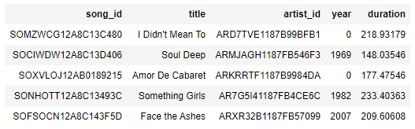

## **Data Modeling with Postgres**

### **Brief Description**
First project of Udacity Data Engineering Nanodegree, that consists of creating a Postgres database with tables designed to optimize queries on song play analysis. This involved defining fact and dimension tables for a star schema, and writing an ETL pipeline that transfers data from files in two local directories into tables in Postgres using Python and SQL.

### **Project Datasets**
I used two datasets. The first dataset (**Song Dataset**) is a subset of real data from the [Million Song Dataset](https://labrosa.ee.columbia.edu/millionsong/). Each file is in JSON format and contains metadata about a song and the artist of that song. 

The second dataset consists of log files in JSON format generated by this [event simulator](https://github.com/Interana/eventsim) based on the songs in the dataset above. These simulate activity logs from a music streaming app based on specified configurations.

### **Repo Structure**
    ├── data
    |   ├── log_data            # Log files based on the Song Dataset
    ├── images                  # Images used on README.md
    |   ├── song_data           # Song Dataset (subset from the Million Song Dataset) 
    ├── create_tables.py        # Drops and creates tables
    ├── sql_queries.py          # Contains all the sql queries
    ├── etl.py                  # Reads and processes files from song_data and log_data and loads them into the tables.
    ├── etl.ipynb               # Playground to test and define the implemented functions on etl.py
    ├── test.ipynb              # Playground with some queries to the the content of the tables

### **Database Schema**

*Database Star Schema - Adapted from this [blog post](https://towardsdatascience.com/data-modeling-for-a-music-streaming-app-db46a4595e4e)*

### **Getting Started**

Run the scripts below to create database/tables and fill them.

    python create_tables.py
    python etl.py

To test them, open `test.ipynb`.

### **Example Queries**

    SELECT * FROM songplays LIMIT 5

    SELECT * FROM users LIMIT 5

    SELECT * FROM songs LIMIT 5

    SELECT * FROM artists LIMIT 5

    SELECT * FROM time LIMIT 5

